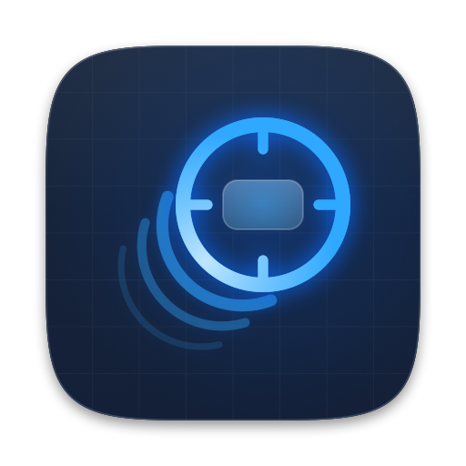
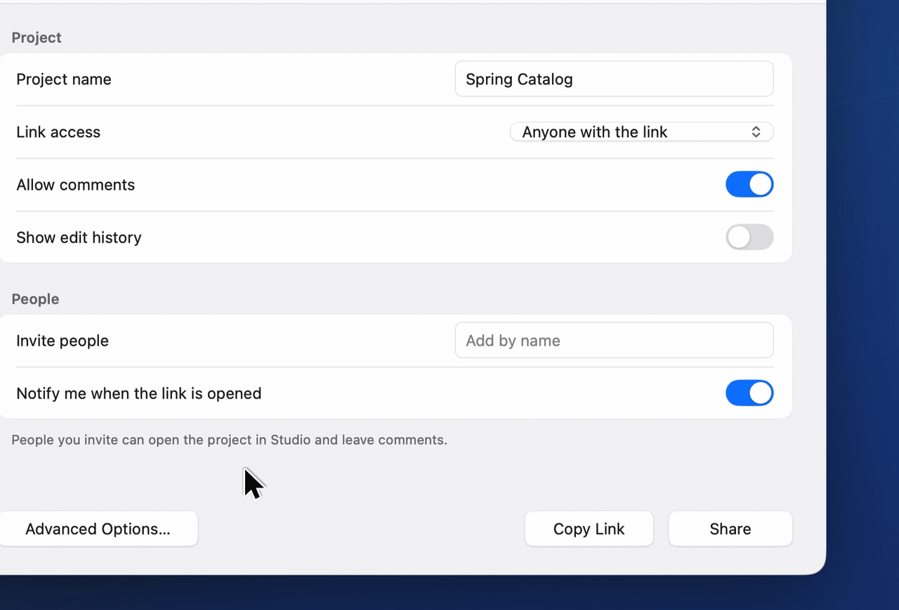
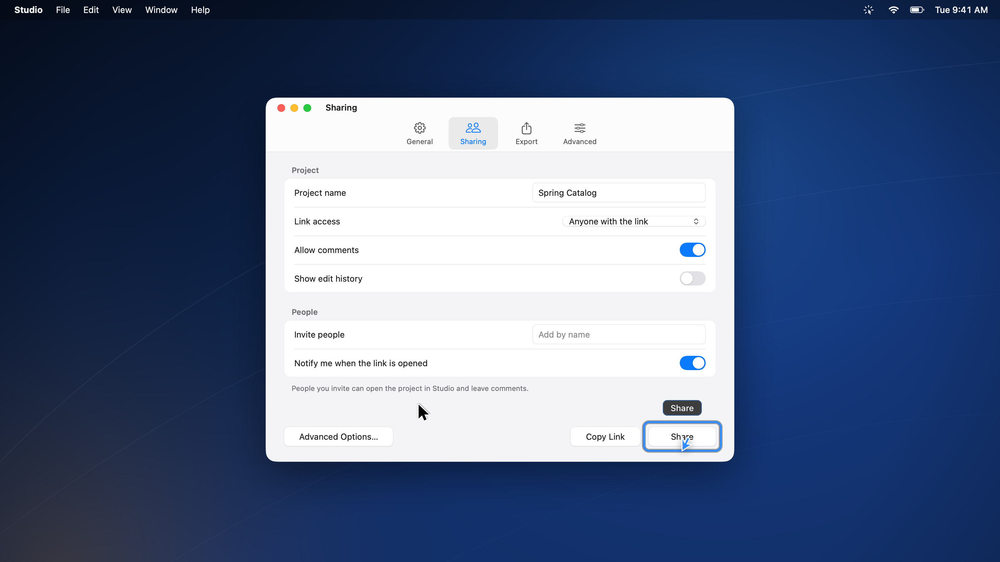
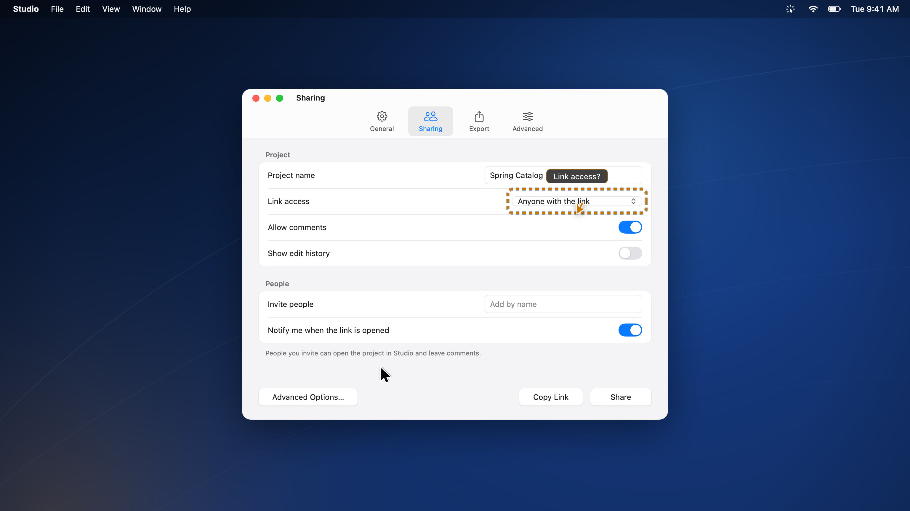
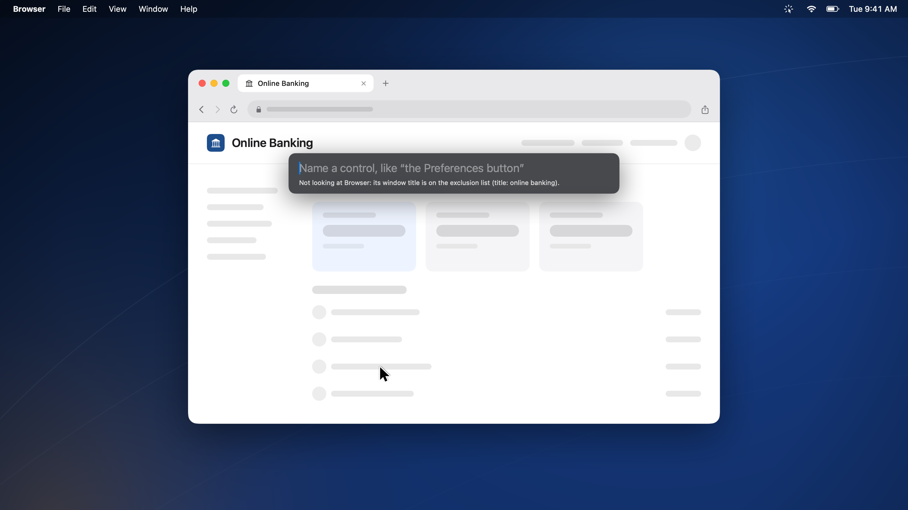
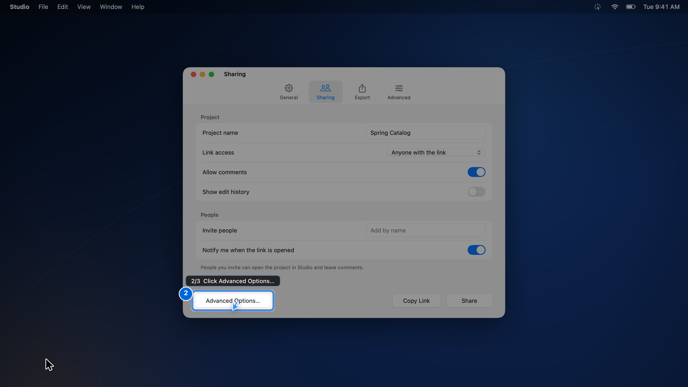
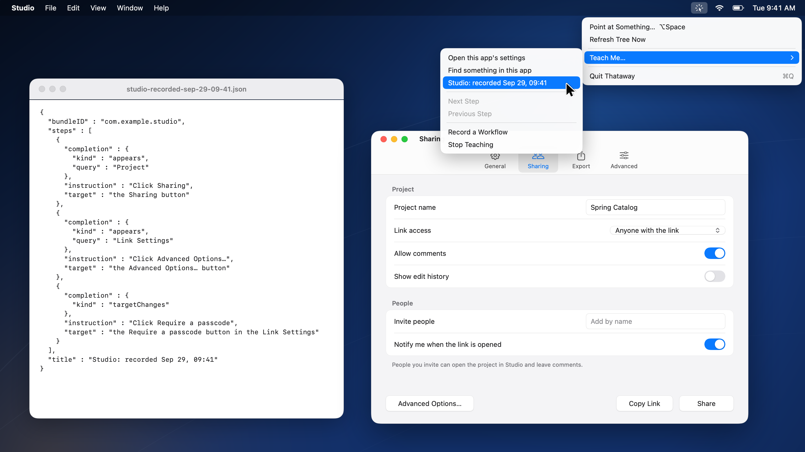

<p align="center">
  
</p>

<h1 align="center">Thataway</h1>

<p align="center">
  <strong>Name a control on your Mac and Thataway points at it.</strong><br>
  Press Option Space, say or type the control you want, and a pointer arcs from your mouse to it.
  Your own cursor stays where it is, nothing gets clicked, and what is on your screen stays on your Mac.
</p>

<p align="center">
  <a href="https://github.com/jke48222/thataway/actions/workflows/ci.yml"></a>
  
  
  <a href="LICENSE"></a>
</p>

<p align="center">
  <a href="#get-started">Get started</a> ·
  <a href="#everyday-use">Everyday use</a> ·
  <a href="#privacy-and-permissions">Privacy</a> ·
  <a href="#limits-and-known-issues">Limits</a> ·
  <a href="#faq">FAQ</a> ·
  <a href="#build-from-source">Build from source</a> ·
  <a href="#how-it-works">How it works</a>
</p>

<p align="center">
  <a href="#get-started"><strong>Build it from source</strong></a>
  &nbsp;·&nbsp;
  <a href="https://github.com/jke48222/thataway/releases">Watch releases on GitHub</a>
  &nbsp;·&nbsp;
  <a href="docs/media/thataway-promo-web.mp4">Watch the film</a>
</p>

<p align="center">
  <sub>Free and open source (MIT) to build today. A signed app is planned at $19 one-time for 1.0; nothing is sold yet.<br>
  Needs macOS 14 or newer on Apple silicon, the Accessibility permission, and Xcode to build it.<br>
  Site: <a href="https://thataway-app.vercel.app">thataway-app.vercel.app</a></sub>
</p>

<p align="center">
  <a href="docs/media/thataway-promo-web.mp4">
    
  </a>
  <br>
  <sub>Click the loop to watch the full film.</sub>
</p>

---

## What is Thataway?

Thataway is a menu bar app for your Mac. Press Option Space, name a control such as "the Share
button", and a pointer arcs from your mouse to that control in the app you are using. The pointer is
drawn on a click-through layer: your own cursor stays put, and Thataway never clicks anything.

It reads the front app's accessibility tree first, which gives each control's exact position.
Only when the tree has no answer does it ask H Company's Holo1.5-7B, a vision model that runs on
your Mac if you install it.

## Why I built it

Telling someone where a button is never works over the phone. "It's in the top right." "I don't
see it." "Under the three dots." "Which three dots?" I built Thataway so I could name the control
and have the Mac point at it. The hard part was speed: a cold accessibility tree read ran 6 to 10
times slower than a warm one, so Thataway reads the tree before you ask.

## Highlights

### The tree first, vision second

Controls come from the accessibility tree with their real bounds. The shortlist re-ranks on every
keystroke (0.067 ms p50 on a Chrome window), and the local model starts only on a miss.

<p align="center">
  
</p>

### It says when it is guessing

An exact answer gets a solid ring, a guess gets a dashed amber ring and a question mark, and no
match gets no pointer.

<p align="center">
  
</p>

### Excluded means never read

Password managers, banks, Messages, Mail and Notes are checked by bundle ID before the first
accessibility call, and the list is a text file you can edit.

<p align="center">
  
</p>

### Lessons wait for you

A lesson dims everything but the next control and moves on when the tree shows you did it.

<p align="center">
  
</p>

### Show it once with Watch me

Record a few clicks and Thataway saves them as a lesson of control names that anyone can replay.

<p align="center">
  
</p>

## Get started

There is no download yet. You build the app from source with one script.

**What you need**

- macOS 14 or newer on Apple silicon. The build is arm64 only.
- Xcode, for the Swift toolchain. No accounts, API keys or third-party Swift packages.
- The Accessibility permission. Thataway does nothing without it.
- For voice (optional): Microphone and Speech Recognition, US English, and a Mac that can
  recognize speech on device.
- For the vision fallback (optional): Screen Recording, a Python with `mlx_vlm` and Pillow, and
  H Company's Holo1.5-7B (Apache 2.0) as a 4-bit MLX build at `~/models/holo1.5-7b-4bit`, about
  5.65 GB. You get the model yourself; it is not bundled.

**Steps**

1. **Clone** the repository: `git clone https://github.com/jke48222/thataway.git`
2. **Enter** the folder: `cd thataway`
3. **Build** the app: `bash Tools/make-app.sh`
4. **Open** it: `open build/Thataway.app`
5. **Allow** Thataway under System Settings, Privacy & Security, Accessibility.
6. **Press** Option Space while another app is in front.
7. **Type** the name of a control, such as `settings`.
8. **Press** Return, and the pointer arcs from your mouse to that control.

Thataway lives in the menu bar and has no Dock icon. `make-app.sh` signs with the first identity
it finds in your keychain: Developer ID with the hardened runtime, then Apple Development, then ad
hoc. No build is notarized. A copy you build yourself opens without a Gatekeeper warning, and the
[FAQ](#faq) covers a copy moved to another Mac.

## Everyday use

| You want to | Do this |
| --- | --- |
| Point at a control by typing | Tap <kbd>Option</kbd> <kbd>Space</kbd>, type its name, press <kbd>Return</kbd> |
| See what it will point at | Watch the top three update as you type; <kbd>Return</kbd> takes the top row |
| Ask out loud | Hold <kbd>Option</kbd> <kbd>Space</kbd>, say the control's name, let go |
| Close the bar | Press <kbd>Escape</kbd> or click away |
| Follow a built-in lesson | Menu bar icon, Teach Me…, then "Open this app's settings" or "Find something in this app" |
| Move through a lesson by hand | Teach Me…, then Next Step or Previous Step |
| Record your own lesson | Teach Me…, Record a Workflow, click through the steps, then Stop Recording & Save |
| Replay a recorded lesson | Teach Me…, then the lesson's name |
| Change what is excluded | Edit `~/.config/thataway/exclusions.conf`; it reloads when you save |

## Privacy and permissions

- **What it reads:** the frontmost app's accessibility tree. That includes on-screen text such as
  labels, values and window titles, and in some apps the content of messages. Only when the tree
  has no answer and the vision fallback is installed does it also take an image of that app's
  windows.
- **When:** when you switch apps; on accessibility events, at most one walk per second (250 ms
  while a lesson is watching); and on a 3-second heartbeat that pauses after 60 seconds without
  keyboard or mouse input.
- **Where it goes:** the tree stays in memory and is never sent anywhere. The image goes to the
  local model process over a pipe, or through a temp file only you can read, deleted after the
  reply. The app has no network code and no analytics.
- **What it saves:** only what you make, under `~/.config/thataway/`: the exclusion list and any
  lessons you record with Watch me. A recording stores control names, not coordinates, and those
  names can contain personal text.
- **What it never reads:** apps and windows on the exclusion list. The bundle check runs before the
  first accessibility call, and excluded apps are never captured either. The defaults are 26
  bundle-ID prefixes and 16 window-title patterns:
  - Password managers: 1Password, Bitwarden, LastPass, Dashlane, Keychain Access, Passwords,
    KeePassXC, Enpass.
  - Money: Wallet, Intuit, Square, PayPal, Coinbase, Robinhood, Chase, Bank of America.
  - Correspondence and health: Messages, Mail, Health, Medical ID, Slack, FaceTime, Signal, Notes.
  - Window titles containing: online banking, bank of, account summary, routing number, credit
    card, medical record, patient portal, lab results, tax return, social security, password,
    seed phrase, private key, recovery phrase, 2fa, one-time code.
- **Not excluded by default:** WhatsApp, Telegram, Discord, Microsoft Teams, Zoom's chat, and web
  mail or web chat in a browser tab unless its window title matches a rule. Add them to
  `exclusions.conf` if you use them.
- **Permissions:** Accessibility, required, with its own prompt. Screen Recording for the vision
  fallback and for checking other apps' window titles against title rules. Microphone and Speech
  Recognition for voice only; recognition runs on device, and voice turns off rather than use a
  server.
- **Planned for the paid 1.0 build, not built yet:** license activation through Polar, which
  contacts Polar when you activate or free a Mac, and opt-in update checks through Sparkle.
  Screen content stays on your Mac either way.

[ARCHITECTURE.md](docs/ARCHITECTURE.md#the-privacy-gate) explains how the gate works and the
test that led to it.

## Limits and known issues

- **No download and no signed build yet.** You build it yourself. There are no GitHub releases.
- **Nothing is notarized.** `make-app.sh` can sign with Developer ID and the hardened runtime, but
  no build has gone through Apple's notarization.
- **Accuracy is measured on one app.** The 12 of 12 is one Google Chrome window, and seven of the
  targets are bookmarks-bar buttons. There is no second-app eval yet.
- **Some apps publish a thin tree.** Canvases and custom-drawn controls are often missing from it.
  Without the vision fallback, the best Thataway can do there is a dashed-ring guess at the
  closest tree match, or no pointer.
- **The vision fallback is a manual setup.** It needs a 5.65 GB model download and a Python with
  `mlx_vlm` and Pillow, and neither ships with the app.
- **Watch me has not been tried with real human clicks.** The `--selftest` harness records and
  replays a step from a real element, but a session driven by a person's clicks is unverified.
- **A lesson can lag a menu by a few seconds.** When a step waits for a menu to open and no
  accessibility event arrives, the 3-second heartbeat is the backstop.
- **Voice is US English only,** and a Mac without on-device recognition gets no voice.
- **Permission setup is partial.** Accessibility has its own prompt. Microphone and Speech
  Recognition use the system's first-use dialogs.
- **Idle CPU, memory and startup time are unmeasured.** The `--idlebench` harness exists, but there
  is no number yet.
- **End-to-end latency with vision has never been timed as one run.**
- **The latency budget gate runs only on a local Mac.** CI has no Accessibility permission.
- **Some code has no unit tests:** the accessibility walk, capture, the overlay on a real display,
  voice and the app's turn logic are checked by hand and by `--selftest`.
- **The renamed build has not been used day to day.** It passes its tests, and a hands-on run is
  still to come.

## FAQ

<details>
<summary><strong>Does Thataway move my mouse or click anything?</strong></summary>

No. The pointer is drawn on a click-through layer above the app. Your own cursor stays where it
is, and nothing is clicked. You do the clicking.

</details>

<details>
<summary><strong>Does anything leave my Mac?</strong></summary>

Not from the app you can build today: it has no network code. The tree stays in memory, and the
optional vision model runs locally. The planned paid build adds license activation through Polar
and opt-in update checks, and screen content stays on your Mac there too.

</details>

<details>
<summary><strong>Why does nothing happen in my password manager or in Messages?</strong></summary>

Those apps are on the default exclusion list, so Thataway never reads them. Instead of a pointer,
the bar says the app is excluded and gives the reason. Edit `~/.config/thataway/exclusions.conf`
to change the list; it reloads when you save.

</details>

<details>
<summary><strong>Do I need the vision model?</strong></summary>

No. Without it, Thataway answers from the accessibility tree alone. The model helps with controls
the tree does not describe, such as custom-drawn ones.

</details>

<details>
<summary><strong>I used the earlier version. Where did my settings go?</strong></summary>

Thataway was called ScreenCoach until September 2026, and the first run of the new version moves `~/.config/screencoach` to `~/.config/thataway`.

</details>

<details>
<summary><strong>Why does macOS ask for Accessibility again after I rebuild?</strong></summary>

macOS ties the permission to the app's signature. With no Apple Development or Developer ID
certificate in your keychain, `make-app.sh` signs ad hoc, and each rebuild looks like a new app.
An Apple Development certificate from Xcode keeps the grant across rebuilds.

</details>

<details>
<summary><strong>I copied a build to another Mac and it won't open.</strong></summary>

No build is notarized, so Gatekeeper blocks a copy that arrives by download or AirDrop. On macOS
14, Control-click the app, choose Open, then Open again. On macOS 15 and later, try to open it
once, then go to System Settings, Privacy & Security, and click Open Anyway. Building on that Mac
avoids the prompt.

</details>

<details>
<summary><strong>What will the signed app cost?</strong></summary>

The plan is $19 one-time for the signed 1.0 build. It is not sold yet and there is no checkout.
The MIT source stays free to build. Watch [releases](https://github.com/jke48222/thataway/releases)
to hear when 1.0 lands.

</details>

<details>
<summary><strong>How do I uninstall Thataway?</strong></summary>

1. Choose Quit Thataway from the menu bar icon.
2. Delete `build/Thataway.app`, or the whole clone.
3. Delete `~/.config/thataway`.
4. Remove Thataway from System Settings, Privacy & Security: Accessibility, plus Screen Recording,
   Microphone and Speech Recognition if you granted them.

</details>

## Build from source

```bash
git clone https://github.com/jke48222/thataway.git
cd thataway
swift build -c release
swift test                                  # 233 tests, headless, no permissions needed
./.build/release/thataway-bench doctor      # environment and permission check
bash Tools/make-app.sh                      # builds and signs build/Thataway.app
```

The 233 Swift tests are 132 for the core, 83 for the system layer and 18 for the bench CLI, and
17 Python tests cover the vision sidecar and the bundling script. The app binary has developer
flags: `--selftest` runs a whole turn without a human and prints the coordinates, `--lessontest`
runs a lesson, and `--idlebench` measures idle CPU and memory.
[BENCHMARKS.md](docs/BENCHMARKS.md#reproduce-the-results) has the full commands, including the
Python tests and the resolver check that CI runs on every push.

## How it works

Before you press anything, Thataway walks the front app's accessibility tree and keeps it warm in
memory. As you type, a lexical resolver ranks the tree's labels on every keystroke. A score of
0.62 or better points right away. Below that, the tree aims a crop, the Holo1.5-7B sidecar starts,
and fusion turns the two answers into one pointer with a confidence the overlay draws.

Measurements set that design. Cold tree reads ran 6 to 10 times slower than warm ones. Batching a
node's attribute reads into one call cut it from 2.54 ms to 0.81 at p50. A warm ScreenCaptureKit
stream beat the `screencapture` tool 7.9 ms to 204 at p90.

- [docs/ARCHITECTURE.md](docs/ARCHITECTURE.md): the turn step by step, the findings that set the
  design, the privacy gate, the tests and the project layout.
- [docs/BENCHMARKS.md](docs/BENCHMARKS.md): every number with its source file, the caveats, and
  how to reproduce them.
- [PHASE-0-FINDINGS.md](PHASE-0-FINDINGS.md): the engineering log, 23 findings.

## Roadmap

- A signed 1.0 build you can download, planned at $19 one-time. Coming soon.
- Measured idle CPU and memory. Coming soon.
- An accuracy eval on a second, denser app. Coming soon.

## Contributing

Bug reports, fixes and measurements from apps other than Chrome are welcome. Please open an issue
before a large change. See [CONTRIBUTING.md](CONTRIBUTING.md), and report security problems
privately as [SECURITY.md](SECURITY.md) describes.

## License

MIT © 2026 Jalen Edusei. See [LICENSE](LICENSE).

The optional vision fallback uses H Company's Holo1.5-7B, released under Apache 2.0. Thataway is
an independent project and is not affiliated with or endorsed by H Company or Apple.
